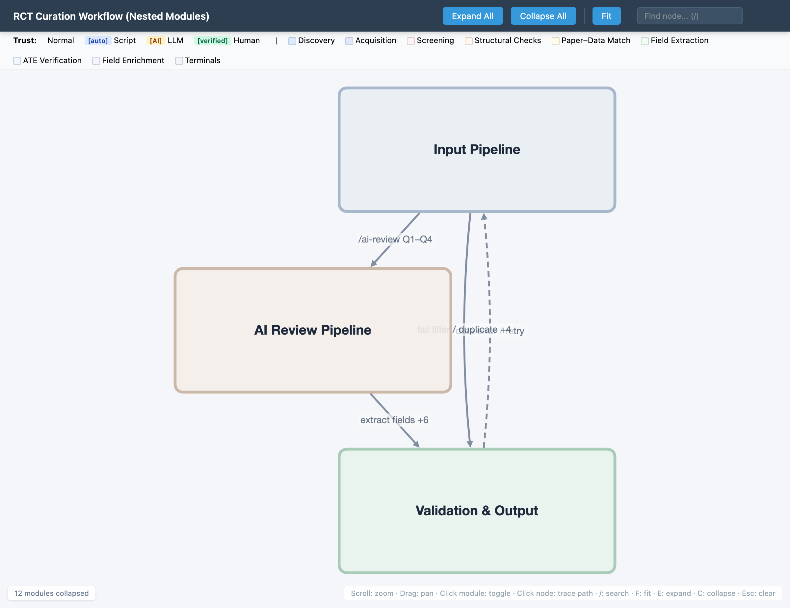

# visual-project-map

**Understand complex projects the way a driver understands a car.**

A car has hundreds of components — engine, transmission, fuel injection, ECU — but the driver only sees a few interpretable interfaces: steering wheel, pedals, dashboard gauges. The internal complexity is hidden behind boundaries that expose just what you need.

Visual Project Map applies this principle to codebases. It generates interactive graphs where each folder is a black box with clearly labeled inputs and outputs. The default view shows only these interfaces — how subsystems connect and what data flows between them. Open a folder only when you need to understand the mechanism inside.

This is not a code visualization tool that tries to show everything. It is an **interface map** that shows you the minimum you need to understand how a project works end-to-end.

## Design Philosophy

1. **Interfaces first, internals on demand.** The collapsed view — showing folders as boxes with their input/output ports — is the primary view, not a simplified fallback. It should be sufficient for someone unfamiliar with the project to understand the overall data flow.

2. **Each folder has a contract.** Just as a car's steering column has a defined interface (turn the wheel → wheels turn), each folder declares what it takes in and what it produces. These contracts are the most important information in the graph.

3. **Complexity lives inside folders, not between them.** Cross-folder connections should be simple (one edge per folder pair). If two folders need multiple connections, the folder boundaries are wrong — just as a car component that requires dozens of custom connectors is poorly designed.

4. **Progressive disclosure.** Start with the interface map. Click a folder to see its internal workflow. Click a node to see file-level details. Each level adds detail without overwhelming.

Built on [Cytoscape.js](https://js.cytoscape.org/) + [dagre](https://github.com/dagrejs/dagre). No build step, no dependencies to install.



## Quick Start — Claude Code

Add the marketplace and install the plugin:

```
/plugin marketplace add georgegui/visual-project-map
/plugin install visual-project-map@visual-project-map
```

Then in any project:

```
/visualize-project
```

Claude analyzes your project's CLAUDE.md files, scripts, and folder structure to auto-generate an interactive workflow graph.

## Quick Start — Manual

1. Create a graph JSON file (see [Input Format](#input-format) below)
2. Serve the viewer:

```bash
python3 scripts/serve.py
# Opens http://localhost:8080 with the default example
```

3. Load your graph: `http://localhost:8080?graph=../path/to/your-graph.json`

## Features

- **Collapsible folders** — overview-first, drill into details on click
- **2-level hierarchy** — phases contain folders contain nodes
- **Meta-edge deduplication** — collapsed folders show merged cross-boundary edges
- **Trust level encoding** — border style/width shows data provenance (raw → automated → AI → verified)
- **Actor annotations** — edge colors show who does the work (human/AI/script/mixed)
- **Edge detail panel** — click edges to see script paths, inputs, outputs, docs
- **Path tracing** — click a node to highlight all upstream/downstream connections
- **Search** — find nodes by label (`/` to focus)
- **Edge labels** — hidden by default, toggle with `L` key
- **Keyboard driven** — `F` fit, `E` expand all, `C` collapse all, `Esc` clear

## Input Format

Graph data is a JSON file with four required fields:

```json
{
  "title": "My Workflow",
  "modules": [
    { "id": "mod_a", "label": "Module A", "color": "#dbeafe", "borderColor": "#93c5fd" }
  ],
  "nodes": [
    { "id": "node1", "module": "mod_a", "label": "state.name" }
  ],
  "edges": [
    { "source": "node1", "target": "node2", "label": "transition", "style": "solid" }
  ]
}
```

### Modules

Compound parent nodes that group related child nodes.

| Field | Required | Description |
|-------|----------|-------------|
| `id` | yes | Unique identifier (prefix: `mod_` or `phase_`) |
| `label` | yes | Display label |
| `color` | yes | Background color (`#rrggbb`) |
| `borderColor` | yes | Border color (`#rrggbb`) |
| `parent` | no | Parent phase module ID (for 2-level nesting) |

### Nodes

Child nodes within folders.

| Field | Required | Description |
|-------|----------|-------------|
| `id` | yes | Unique identifier |
| `module` | yes | Parent module ID |
| `label` | yes | Display label |
| `style.trust` | no | Trust level key (maps to legend) |
| `style.shape` | no | `round-rectangle` (default), `diamond`, `ellipse`, `rectangle`, `hexagon` |
| `style.color` | no | Override background color |
| `style.borderColor` | no | Override border color |

### Edges

Directed connections between nodes.

| Field | Required | Description |
|-------|----------|-------------|
| `source` | yes | Source node ID |
| `target` | yes | Target node ID |
| `label` | no | Edge label text |
| `style` | no | `"solid"` (default) or `"dashed"` |
| `actor` | no | `"human"`, `"ai"`, `"script"`, `"mixed"` |
| `details` | no | Object: `{ script, input[], output[], updates[], docs }` |

### Legend (optional)

Trust level definitions with visual styling:

```json
{
  "legend": {
    "trustLevels": {
      "normal": { "label": "Normal", "borderStyle": "solid", "borderWidth": 1.5 },
      "auto": { "label": "Script", "borderStyle": "solid", "borderWidth": 1.5,
                "tag": { "text": "auto", "bg": "#dbeafe", "color": "#1e40af" } },
      "ai": { "label": "LLM", "borderStyle": "dashed", "borderWidth": 1.5,
              "tag": { "text": "AI", "bg": "#fef3c7", "color": "#92400e" } },
      "verified": { "label": "Human", "borderStyle": "solid", "borderWidth": 3.5,
                    "tag": { "text": "verified", "bg": "#d1fae5", "color": "#065f46" } }
    }
  }
}
```

## Keyboard Shortcuts

| Key | Action |
|-----|--------|
| `F` | Fit to viewport |
| `E` | Expand all folders |
| `C` | Collapse all folders |
| `L` | Toggle edge labels |
| `/` | Focus search input |
| `Esc` | Clear selection / search / path trace |

## Examples

| File | Description |
|------|-------------|
| `examples/minimal.json` | Simple 3-folder pipeline with trust levels |
| `examples/data-pipeline.json` | ETL pipeline with actor annotations and edge details |
| `examples/ci-cd-workflow.json` | CI/CD with nested phases and decision gates |

## Architecture

Three JS modules loaded via CDN script tags (no build step):

```
viewer/index.html              # Entry point, CDN deps, HTML/CSS
viewer/src/expand-collapse.js  # CollapseManager: collapse/expand via cy.remove/add
viewer/src/viewer.js           # Load JSON, build Cytoscape elements, styles, layout
viewer/src/interactions.js     # Click, hover, tooltip, keyboard, toolbar
```

Full feature catalog: [`spec/features.md`](spec/features.md)
Graph constraints: [`spec/graph-properties.md`](spec/graph-properties.md)
JSON Schema: [`schema.json`](schema.json)

## License

MIT
